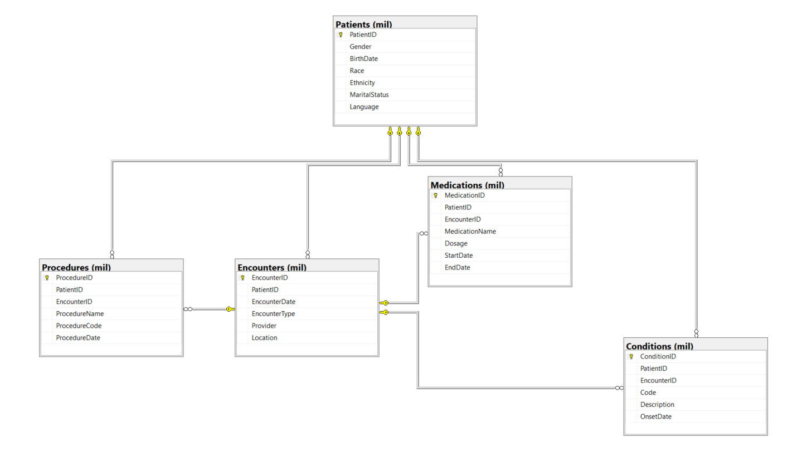

# 🏥 Healthcare Data ETL Project

This project simulates a real-world healthcare data engineering pipeline. It ingests synthetic health data, transforms it using Python, and loads it into a normalized SQL Server database for downstream analytics or AI model consumption.

---

## 🚀 Project Goals

- Practice designing and implementing a real-world ETL pipeline
- Work with healthcare domain data (Synthea)
- Use Python to automate transformation and loading to SQL Server
- Produce a professional, GitHub-worthy data engineering portfolio project

---

## 🧱 Project Structure

```
healthcare_etl_project/
│
├── data/
│   ├── raw/                # Raw input files (CSV)
│   └── processed/          # Cleaned/transformed intermediate files
│
├── etl/                    # Python ETL scripts and reusable modules
│   ├── load_patients.py
│   ├── load_encounters.py
│   ├── load_conditions.py
│   ├── load_medications.py
│   ├── load_procedures.py
│   ├── sql_connection.py
│   └── logging_util.py
│
├── sql/                    # SQL Server schema creation scripts
├── docs/                   # Documentation and schema diagram
├── logs/                   # Timestamped runtime logs
└── README.md
```

---

## 🗂️ Database Schema

This project uses a normalized healthcare schema based on synthetic patient data (e.g., from Synthea).

### Core Tables

- `Patients`: Core patient demographics
- `Encounters`: Visit records linked to patients
- `Conditions`: Diagnoses tied to patients and encounters
- `Medications`: Treatments linked to encounters
- `Procedures`: Medical procedures performed

### 📊 Schema Diagram



> The diagram shows table structures and foreign key relationships. Arrows indicate dependency direction.

---

## ⚙️ Tech Stack

- Python 3.x
  - `pandas`, `pyodbc`
- Microsoft SQL Server Express
- Visual Studio Code or Visual Studio 2022
- ODBC Driver 17 for SQL Server

---

## 🧪 How to Run

1. Install requirements:
   ```bash
   pip install pandas pyodbc
   ```

2. Create your SQL Server database and run the schema in `/sql/`.

3. Add your data files from [Synthea](https://github.com/synthetichealth/synthea) to:
   ```
   /data/raw/
   ```

4. Run ETL scripts:
   ```bash
   python etl/load_patients.py
   python etl/load_encounters.py
   python etl/load_conditions.py
   python etl/load_medications.py
   python etl/load_procedures.py
   ```

5. Check logs in `/logs/` for detailed output.

---

## 📈 Future Enhancements

- Add `Observations` or `Labs` loader
- Schedule ETLs with Prefect or Airflow
- Add a FastAPI layer for querying/reporting
- Build SQL views and BI dashboards

---

## 📄 License

This project is for educational and portfolio use only. Synthetic data sourced from [Synthea](https://synthetichealth.github.io/synthea/).
